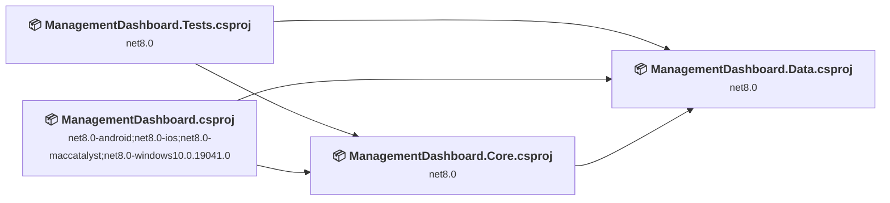
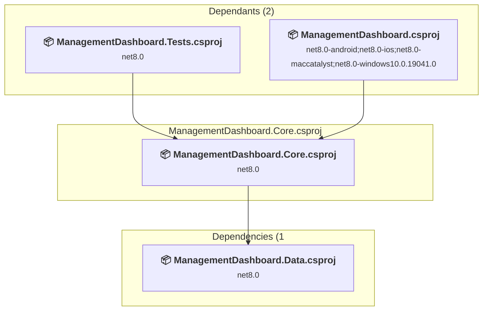
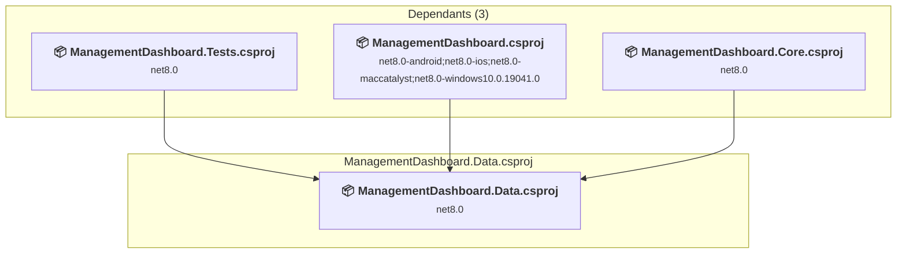
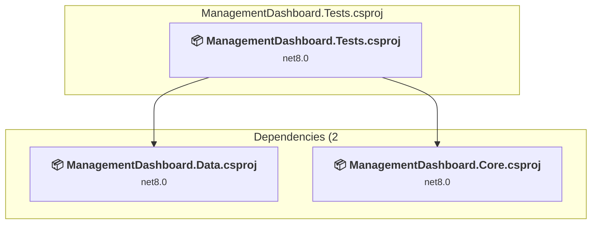
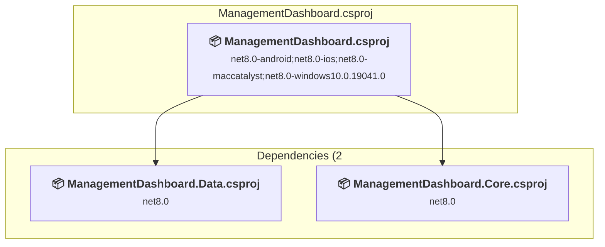

# Projects and dependencies analysis

This document provides a comprehensive overview of the projects and their dependencies in the context of upgrading to .NETCoreApp,Version=v10.0.

## Table of Contents

- [Executive Summary](#executive-Summary)
  - [Highlevel Metrics](#highlevel-metrics)
  - [Projects Compatibility](#projects-compatibility)
  - [Package Compatibility](#package-compatibility)
  - [API Compatibility](#api-compatibility)
- [Aggregate NuGet packages details](#aggregate-nuget-packages-details)
- [Top API Migration Challenges](#top-api-migration-challenges)
  - [Technologies and Features](#technologies-and-features)
  - [Most Frequent API Issues](#most-frequent-api-issues)
- [Projects Relationship Graph](#projects-relationship-graph)
- [Project Details](#project-details)

  - [ManagementDashboard.Core\ManagementDashboard.Core.csproj](#managementdashboardcoremanagementdashboardcorecsproj)
  - [ManagementDashboard.Data\ManagementDashboard.Data.csproj](#managementdashboarddatamanagementdashboarddatacsproj)
  - [ManagementDashboard.Tests\ManagementDashboard.Tests.csproj](#managementdashboardtestsmanagementdashboardtestscsproj)
  - [ManagementDashboard\ManagementDashboard.csproj](#managementdashboardmanagementdashboardcsproj)

## Executive Summary

### Highlevel Metrics

| Metric | Count | Status |
| :--- | :---: | :--- |
| Total Projects | 4 | All require upgrade |
| Total NuGet Packages | 11 | 2 need upgrade |
| Total Code Files | 51 |  |
| Total Code Files with Incidents | 4 |  |
| Total Lines of Code | 2414 |  |
| Total Number of Issues | 6 |  |
| Estimated LOC to modify | 0+ | at least 0.0% of codebase |

### Projects Compatibility

| Project | Target Framework | Difficulty | Package Issues | API Issues | Est. LOC Impact | Description |
| :--- | :---: | :---: | :---: | :---: | :---: | :--- |
| [ManagementDashboard.Core\ManagementDashboard.Core.csproj](#managementdashboardcoremanagementdashboardcorecsproj) | net8.0 | 🟢 Low | 0 | 0 |  | ClassLibrary, Sdk Style = True |
| [ManagementDashboard.Data\ManagementDashboard.Data.csproj](#managementdashboarddatamanagementdashboarddatacsproj) | net8.0 | 🟢 Low | 1 | 0 |  | ClassLibrary, Sdk Style = True |
| [ManagementDashboard.Tests\ManagementDashboard.Tests.csproj](#managementdashboardtestsmanagementdashboardtestscsproj) | net8.0 | 🟢 Low | 0 | 0 |  | DotNetCoreApp, Sdk Style = True |
| [ManagementDashboard\ManagementDashboard.csproj](#managementdashboardmanagementdashboardcsproj) | net8.0-android;net8.0-ios;net8.0-maccatalyst;net8.0-windows10.0.19041.0 | 🟢 Low | 1 | 0 |  | DotNetCoreApp, Sdk Style = True |

### Package Compatibility

| Status | Count | Percentage |
| :--- | :---: | :---: |
| ✅ Compatible | 9 | 81.8% |
| ⚠️ Incompatible | 0 | 0.0% |
| 🔄 Upgrade Recommended | 2 | 18.2% |
| ***Total NuGet Packages*** | ***11*** | ***100%*** |

### API Compatibility

| Category | Count | Impact |
| :--- | :---: | :--- |
| 🔴 Binary Incompatible | 0 | High - Require code changes |
| 🟡 Source Incompatible | 0 | Medium - Needs re-compilation and potential conflicting API error fixing |
| 🔵 Behavioral change | 0 | Low - Behavioral changes that may require testing at runtime |
| ✅ Compatible | 2813 |  |
| ***Total APIs Analyzed*** | ***2813*** |  |

## Aggregate NuGet packages details

| Package | Current Version | Suggested Version | Projects | Description |
| :--- | :---: | :---: | :--- | :--- |
| coverlet.collector | 6.0.2 |  | [ManagementDashboard.Tests.csproj](#managementdashboardtestsmanagementdashboardtestscsproj) | ✅Compatible |
| Dapper | 2.1.66 |  | [ManagementDashboard.Data.csproj](#managementdashboarddatamanagementdashboarddatacsproj) | ✅Compatible |
| Formula.SimpleRepo | 1.8.3 |  | [ManagementDashboard.Data.csproj](#managementdashboarddatamanagementdashboarddatacsproj) | ✅Compatible |
| Microsoft.AspNetCore.Components.WebView.Maui |  |  | [ManagementDashboard.csproj](#managementdashboardmanagementdashboardcsproj) | ✅Compatible |
| Microsoft.Data.Sqlite | 8.0.0 | 10.0.5 | [ManagementDashboard.Data.csproj](#managementdashboarddatamanagementdashboarddatacsproj) | NuGet package upgrade is recommended |
| Microsoft.Extensions.Logging.Debug | 8.0.0 | 10.0.5 | [ManagementDashboard.csproj](#managementdashboardmanagementdashboardcsproj) | NuGet package upgrade is recommended |
| Microsoft.Maui.Controls |  |  | [ManagementDashboard.csproj](#managementdashboardmanagementdashboardcsproj) | ✅Compatible |
| Microsoft.NET.Test.Sdk | 17.12.0 |  | [ManagementDashboard.Tests.csproj](#managementdashboardtestsmanagementdashboardtestscsproj) | ✅Compatible |
| Moq | 4.20.72 |  | [ManagementDashboard.Tests.csproj](#managementdashboardtestsmanagementdashboardtestscsproj) | ✅Compatible |
| xunit | 2.9.2 |  | [ManagementDashboard.Tests.csproj](#managementdashboardtestsmanagementdashboardtestscsproj) | ✅Compatible |
| xunit.runner.visualstudio | 2.8.2 |  | [ManagementDashboard.Tests.csproj](#managementdashboardtestsmanagementdashboardtestscsproj) | ✅Compatible |

## Top API Migration Challenges

### Technologies and Features

| Technology | Issues | Percentage | Migration Path |
| :--- | :---: | :---: | :--- |

### Most Frequent API Issues

| API | Count | Percentage | Category |
| :--- | :---: | :---: | :--- |

## Projects Relationship Graph

Legend:
📦 SDK-style project
⚙️ Classic project

## Project Details

### ManagementDashboard.Core\ManagementDashboard.Core.csproj

#### Project Info

- **Current Target Framework:** net8.0
- **Proposed Target Framework:** net10.0
- **SDK-style**: True
- **Project Kind:** ClassLibrary
- **Dependencies**: 1
- **Dependants**: 2
- **Number of Files**: 7
- **Number of Files with Incidents**: 1
- **Lines of Code**: 207
- **Estimated LOC to modify**: 0+ (at least 0.0% of the project)

#### Dependency Graph

Legend:
📦 SDK-style project
⚙️ Classic project

### API Compatibility

| Category | Count | Impact |
| :--- | :---: | :--- |
| 🔴 Binary Incompatible | 0 | High - Require code changes |
| 🟡 Source Incompatible | 0 | Medium - Needs re-compilation and potential conflicting API error fixing |
| 🔵 Behavioral change | 0 | Low - Behavioral changes that may require testing at runtime |
| ✅ Compatible | 228 |  |
| ***Total APIs Analyzed*** | ***228*** |  |

### ManagementDashboard.Data\ManagementDashboard.Data.csproj

#### Project Info

- **Current Target Framework:** net8.0
- **Proposed Target Framework:** net10.0
- **SDK-style**: True
- **Project Kind:** ClassLibrary
- **Dependencies**: 0
- **Dependants**: 3
- **Number of Files**: 11
- **Number of Files with Incidents**: 1
- **Lines of Code**: 499
- **Estimated LOC to modify**: 0+ (at least 0.0% of the project)

#### Dependency Graph

Legend:
📦 SDK-style project
⚙️ Classic project

### API Compatibility

| Category | Count | Impact |
| :--- | :---: | :--- |
| 🔴 Binary Incompatible | 0 | High - Require code changes |
| 🟡 Source Incompatible | 0 | Medium - Needs re-compilation and potential conflicting API error fixing |
| 🔵 Behavioral change | 0 | Low - Behavioral changes that may require testing at runtime |
| ✅ Compatible | 543 |  |
| ***Total APIs Analyzed*** | ***543*** |  |

### ManagementDashboard.Tests\ManagementDashboard.Tests.csproj

#### Project Info

- **Current Target Framework:** net8.0
- **Proposed Target Framework:** net10.0
- **SDK-style**: True
- **Project Kind:** DotNetCoreApp
- **Dependencies**: 2
- **Dependants**: 0
- **Number of Files**: 9
- **Number of Files with Incidents**: 1
- **Lines of Code**: 633
- **Estimated LOC to modify**: 0+ (at least 0.0% of the project)

#### Dependency Graph

Legend:
📦 SDK-style project
⚙️ Classic project

### API Compatibility

| Category | Count | Impact |
| :--- | :---: | :--- |
| 🔴 Binary Incompatible | 0 | High - Require code changes |
| 🟡 Source Incompatible | 0 | Medium - Needs re-compilation and potential conflicting API error fixing |
| 🔵 Behavioral change | 0 | Low - Behavioral changes that may require testing at runtime |
| ✅ Compatible | 1096 |  |
| ***Total APIs Analyzed*** | ***1096*** |  |

### ManagementDashboard\ManagementDashboard.csproj

#### Project Info

- **Current Target Framework:** net8.0-android;net8.0-ios;net8.0-maccatalyst;net8.0-windows10.0.19041.0
- **Proposed Target Framework:** net8.0-android;net8.0-ios;net8.0-maccatalyst;net8.0-windows10.0.19041.0;net10.0-windows
- **SDK-style**: True
- **Project Kind:** DotNetCoreApp
- **Dependencies**: 2
- **Dependants**: 0
- **Number of Files**: 2176
- **Number of Files with Incidents**: 1
- **Lines of Code**: 1075
- **Estimated LOC to modify**: 0+ (at least 0.0% of the project)

#### Dependency Graph

Legend:
📦 SDK-style project
⚙️ Classic project

### API Compatibility

| Category | Count | Impact |
| :--- | :---: | :--- |
| 🔴 Binary Incompatible | 0 | High - Require code changes |
| 🟡 Source Incompatible | 0 | Medium - Needs re-compilation and potential conflicting API error fixing |
| 🔵 Behavioral change | 0 | Low - Behavioral changes that may require testing at runtime |
| ✅ Compatible | 946 |  |
| ***Total APIs Analyzed*** | ***946*** |  |

